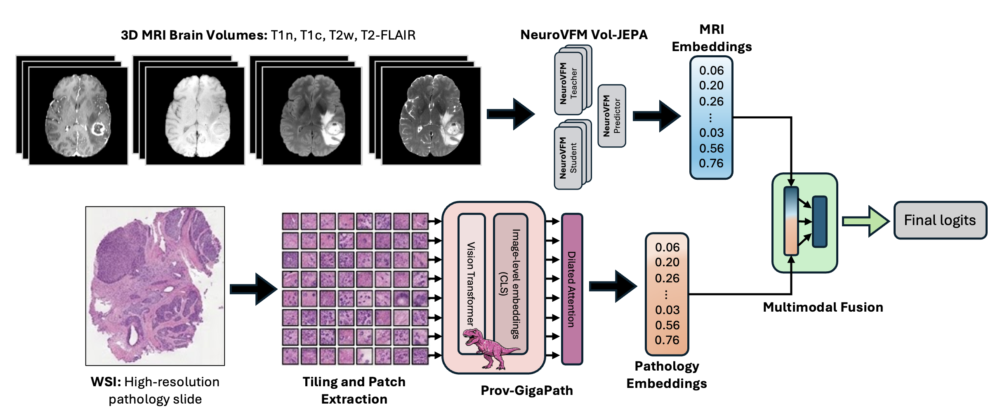

<h1 align="center">CoRe-BT: Joint Radiology-Pathology Learning
for Multimodal Brain Tumor Typing</h1>

    <a href="https://www.imageclef.org/2026/medical/mediqa-coret">Challenge Description</a> |
    <a href="https://ai4media-bench.aimultimedialab.ro/competitions/6/">Registration</a> |
    <a href="assets/manuscript.pdf">Manuscript</a>
    <!-- <a href="#bibtex">BibTeX</a> | -->
    

  
    
  

Juampablo E. Heras Rivera†, Daniel K Low†, Wen-wai Yim, Jacob Ruzevick, Xavier Xiong, Mehmet Kurt*, Asma Ben Abacha* 

† Equal contribution, * Shared last authorship

<table>
<tr>
<td>

**[KurtLab, University of Washington](https://www.kurtlab.com/)**  
**[Microsoft Health AI, Microsoft](https://www.microsoft.com/en-us/research/lab/microsoft-health-futures/)**

</td>
<!-- <td width="200"></td> spacer column -->
<td align="right">
  
</td>
</tr>
</table>

<h2 align="center">Repo Structure</h2>

<table align="center">
<tr>
<td><strong><a href="./CLAM/">CLAM/</a></strong></td>
<td>
Data preprocessing and whole-slide tiling utilities based on CLAM[1]. 
Includes custom artifact removal using HSV color-based segmentation and tiling pipelines for WSI patch extraction.
</td>
</tr>

<tr>
<td><strong><a href="./gigapath/">gigapath/</a></strong></td>
<td>
Whole-slide histopathology embedding pipeline using the Prov-GigaPath foundation model[2].
Uses tiles generated from CLAM to compute slide-level embeddings.
</td>
</tr>

<tr>
<td><strong><a href="./NeuroVFM/">NeuroVFM/</a></strong></td>
<td>
MRI foundation model framework for multi-sequence brain MRI embedding[3].
Produces subject-level embeddings from T1, T1c, T2, and FLAIR sequences.
</td>
</tr>

<tr>
<td><strong><a href="./dataset_utils/">dataset_utils/</a></strong></td>
<td>
Dataset construction, subject matching, metadata processing, and split generation utilities.
</td>
</tr>

<tr>
<td><strong><a href="./experiments/">experiments/</a></strong></td>
<td>
Scripts for multimodal embedding fusion and downstream tumor typing experiments, including modality ablation studies and evaluation pipelines.
</td>
</tr>
</table>

 

[1] Lu, M.Y., Williamson, D.F.K., Chen, T.Y. et al. Data-efficient and weakly supervised computational pathology on whole-slide images. Nat Biomed Eng 5, 555–570 (2021).   
[2] Xu, Hanwen, et al. "A whole-slide foundation model for digital pathology from real-world data." Nature 630.8015 (2024): 181-188.    
[3] Kondepudi, Akhil, et al. "Health system learning achieves generalist neuroimaging models." arXiv preprint arXiv:2511.18640 (2025).

